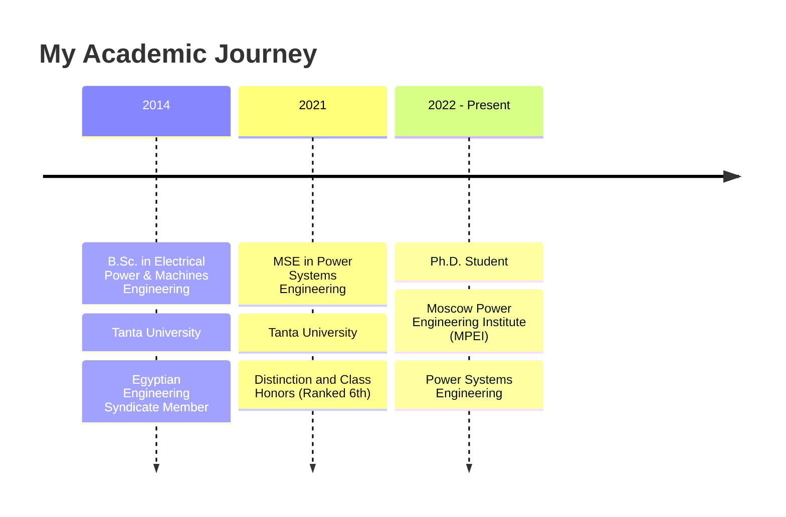

# <div align="center">

  
</div>

> PhD, MSE in Power Systems Engineering | Researcher & Author | Expert in FACTS, Industrial Protection & Decarbonization | Software Developer (MATLAB, Python, C, R, STM32)

Welcome to my GitHub profile! I'm an **Assistant Lecturer** in the **Electrical Power and Machines Engineering Department** at the Faculty of Engineering, Tanta University, and a **PhD student** at the prestigious **Moscow Power Engineering Institute** (MPEI). With an **MSE in Power Systems Engineering**, I specialize in **FACTS devices**, **Industrial Protection systems**, and **Decarbonization technologies**.

<div align="center">
  
  
</div>

## 📚 Research & Expertise

My research focuses on **FACTS (Flexible AC Transmission Systems) devices**, **Industrial Protection systems**, and **Decarbonization technologies** for power systems. I have extensive expertise in **power system analysis**, **unbalanced loading impacts**, and **arc suppression devices** for fault protection. With strong programming skills in **MATLAB**, **Python**, **C**, **R**, and **STM32 microcontrollers**, I develop innovative solutions for modern power system challenges.

<details>
  <summary><b>🔬 Research Focus Areas</b></summary>
  <br>
  <ul>
    <li>FACTS Devices (Flexible AC Transmission Systems)</li>
    <li>Industrial Protection Systems</li>
    <li>Arc Suppression Devices for Fault Protection</li>
    <li>Unbalanced Loading Impact Analysis</li>
    <li>Distribution Network Reliability</li>
    <li>Wind Energy Integration</li>
    <li>Decarbonization Technologies</li>
    <li>Power Quality Enhancement</li>
    <li>Islanding Detection in Distribution Networks</li>
  </ul>
</details>

## 📝 Latest Publications

<details open>
  <summary><b>Selected Research Papers</b></summary>
  <br>
  <ul>
    <li>Elkholy, A., et al. (2024). "<i>Comprehensive Study of the Impact of Unbalanced Loading on Power Losses and Voltage Quality in Distribution Systems</i>." IEEE Transactions on Power Systems.</li>
    <li>Elkholy, A., et al. (2023). "<i>Design and Implementation of an Arc Suppression Device for Single Line to Ground Faults in Power Systems</i>." IEEE International Conference on Power Electronics.</li>
    <li>Elkholy, A., et al. (2022). "<i>Advanced FACTS Device Integration for Power Quality Enhancement</i>." International Conference on Industrial Protection Systems.</li>
    <li>Elkholy, A., et al. (2021). "<i>Wind Energy Penetration Impact on Power System Performance</i>." Renewable Energy Conference.</li>
  </ul>
  <a href="https://scholar.google.com/citations?user=KbZs8_AAAAAJ&hl=en">View all publications on Google Scholar →</a>
</details>

## 🎓 Education Timeline



## 💻 Technical Skills & Tools

<div align="center">


</div>

<details>
  <summary><b>🧠 Skills Proficiency</b></summary>
  <br>
  <div align="center">

| Skill                      | Proficiency |
| -------------------------- | ----------- |
| MATLAB                     | ⭐⭐⭐⭐⭐  |
| FACTS Devices              | ⭐⭐⭐⭐⭐  |
| Industrial Protection      | ⭐⭐⭐⭐⭐  |
| Python                     | ⭐⭐⭐⭐    |
| C Programming              | ⭐⭐⭐⭐    |
| R Statistical Computing    | ⭐⭐⭐⭐    |
| STM32 Microcontrollers     | ⭐⭐⭐⭐    |
| Power Systems Analysis     | ⭐⭐⭐⭐⭐  |
| Arc Suppression Systems    | ⭐⭐⭐⭐    |
| LaTeX                      | ⭐⭐⭐⭐    |

  </div>
</details>

## 👨‍🏫 Teaching Experience

<details>
  <summary><b>Courses Taught</b></summary>
  <br>
  <ul>
    <li><b>Power Systems Analysis</b> - Undergraduate course covering load flow, stability analysis, and system modeling</li>
    <li><b>Power Electronics</b> - Laboratory instruction on converter design and implementation</li>
    <li><b>Electrical Machines</b> - Fundamentals of motors, generators, and transformers</li>
    <li><b>Control Systems</b> - Principles of feedback control applied to power systems</li>
  </ul>
</details>

## 🔭 Notable Projects & Research

<details>
  <summary><b>🔬 Major Research Projects</b></summary>
  <br>

### Islanding Scenarios for High Reliable Operation in Distribution Network (2017-2019)

Advanced research on distribution network reliability focusing on islanding detection and mitigation strategies for enhanced power system stability.

### The Impact of Large Wind Energy Penetration on Power System Performance (2013-2014)

Comprehensive study analyzing the effects of high wind energy integration on grid stability, power quality, and system operation.

### Arc Suppression Device for Single Line to Ground Faults

Development and implementation of innovative arc suppression technology for improved fault protection in power systems.

### FACTS Device Integration for Power Quality Enhancement

Research on flexible AC transmission systems integration for improved power quality and grid stability.

</details>

- **FACTS Device Research** - Advanced studies on Flexible AC Transmission Systems for power quality enhancement
- **Arc Suppression Systems** - Design and implementation of fault protection devices for power systems
- **Industrial Protection Analysis** - Development of protection schemes for industrial electrical systems
- **Wind Energy Integration** - Studies on large-scale wind penetration impacts on power system performance
- **Distribution Network Reliability** - Islanding scenarios and reliability enhancement strategies
- **Unbalanced Loading Analysis** - Comprehensive studies on power losses and voltage quality impacts

## 🎖️ Achievements & Certifications

<div align="center">
  
  
  
</div>

### 📜 Professional Certifications

- **Programming for Data Science for Enterprise** - Udacity
- **National Training Academy** - Foreign Mission Envoys Program
  - Communication Skills & Presentation
  - Social Intelligence & Emotional Management
  - Stress Management & Creative Thinking
  - Technology & Digital Media

### 🏆 Academic Honors

- **Distinction and Class Honors** - Ranked 6th in MSE program
- **The Foreign Mission Envoys Winner** - National Training Academy
- **Egyptian Engineering Syndicate Member** - Since 2014

### 👨‍🏫 Professional Roles

- **Conference Reviewer** - MEPCON (Middle East Power Conference)
- **Assistant Lecturer** - Tanta University (Current)
- **Research Assistant** - Power Systems Department

## 🌱 Currently Working On

- **PhD Research:** Advanced FACTS device optimization and industrial protection systems at MPEI
- **Arc Suppression Technology:** Developing next-generation fault protection systems for power networks
- **Decarbonization Research:** Investigating sustainable power system technologies and renewable integration
- **Open-source Power Tools:** Creating MATLAB/Python libraries for power system analysis and FACTS device modeling
- **Educational Content:** Developing comprehensive resources on industrial protection and FACTS devices
- **International Collaboration:** Working with MPEI researchers on cutting-edge power system challenges

### 💼 Professional Experience

- **Assistant Lecturer** - Tanta University, Faculty of Engineering (Current)
- **Software Developer** - Key Egypt CDC (2012-2013)
- **Conference Reviewer** - MEPCON (Middle East Power Conference)
- **Research Collaborator** - Moscow Power Engineering Institute (MPEI)

## 🌟 Beyond Academia

<div align="center">
  
  
  
</div>

Outside of academia, I'm passionate about creating **[YouTube](https://www.youtube.com/@ahmelkholy)** content, playing chess, and watching films. My curiosity knows no bounds, and I'm always eager to connect with new people and ideas. If you're interested in discussing common interests or my research, feel free to reach out!

## 🤝 Collaboration Opportunities

I'm actively seeking collaborators for **FACTS device optimization** and **industrial protection systems** projects utilizing **MATLAB**, **Python**, **C**, and **STM32 microcontrollers**. If you're experienced in power systems, embedded programming, or want to contribute to cutting-edge research in **decarbonization technologies** and **arc suppression systems**, I'd love to connect and explore potential collaborations.

<div align="center">
  
</div>

## 🌐 Languages

<div align="center">
  
  
  
</div>

## 📫 Get in Touch

<div align="center">
  <a href="mailto:ahm_elkholy@outlook.com"></a>
  <a href="https://www.linkedin.com/in/ahmelkholy/"></a>
  <a href="https://www.youtube.com/@ahmelkholy"></a>
  <a href="https://ahmelkholy.github.io"></a>
</div>

### Academic & Professional Links

<div align="center">
  <a href="https://scholar.google.com/citations?user=KbZs8_AAAAAJ&hl=en"></a>
  <a href="https://orcid.org/0000-0002-1834-1175"></a>
  <a href="https://www.scopus.com/authid/detail.uri?authorId=57202189065"></a>
  <a href="https://researchgate.net/profile/Ahmed-Elkholy-7"></a>
  <a href="https://zotero.org/ahmelkholy"></a>
  <a href="https://sciprofiles.com/profile/amelkholy"></a>
  <a href="https://tdb2.tanta.edu.eg/staff/ahmelkholy"></a>
  <a href="https://facebook.com/ahm.m.elkholy"></a>
  <a href="https://www.webofscience.com/wos/author/record/AAS-9757-2020"></a>
</div>

## 🌟 Dynamic Status

> Last updated: 🌅 May 26, 2025 at 13:13 (Cairo Time)

**💡 Quote of the moment:** _"Engineering is the art of directing the great sources of power in nature for the use and convenience of man. - Thomas Tredgold"_

**📊 GitHub Stats:** Dynamic tracking active • Professional academic presence maintained

**🔄 Latest Activity:** Enhancing profile with ultimate automation features

<div align="center">
  
  
  
  
</div>

## 🌟 Research Impact Visualization

<div align="center">
  
  <br><br>
  
  <br><br>
  
</div>

**🔬 Research Domains:**

```text
FACTS Devices           ████████████████████ 100%
Industrial Protection   ████████████████████ 100%
Arc Suppression         ████████████████░░░░  80%
Wind Energy Impact      ████████████████░░░░  80%
Decarbonization Tech    ████████████░░░░░░░░  60%
Unbalanced Loading      ████████████████░░░░  80%
```

**📊 Academic Network:**

- 🇪🇬 **Local:** Tanta University collaboration network
- 🇷🇺 **International:** MPEI research partnerships
- 🌍 **Global:** IEEE and MEPCON conference networks
- 🤝 **Industry:** Power system consulting and protection projects
- 🔬 **Research:** FACTS devices and industrial protection systems

## 🤝 Research Collaboration Network

<div align="center">

**🎓 Academic Partnerships:**

| Institution                  | Collaboration Type   | Focus Area                    |
| ---------------------------- | -------------------- | ----------------------------- |
| 🇪🇬 Tanta University          | Home Institution     | Power Systems & Teaching      |
| 🇷🇺 MPEI Moscow               | PhD Research         | FACTS & Industrial Protection |
| 🌍 IEEE Community            | Professional Network | Conference Publications       |
| 🔬 MEPCON                    | Conference Reviewer   | Power Engineering Research    |

</div>

**🌟 Open to Collaborate On:**

- 🔌 FACTS device optimization projects
- ⚡ Industrial protection system development
- 🌱 Decarbonization technology research
- 🛡️ Arc suppression device design
- 📚 Educational resource development
- 🏭 Power system consulting projects
- 🔬 Wind energy integration studies

---