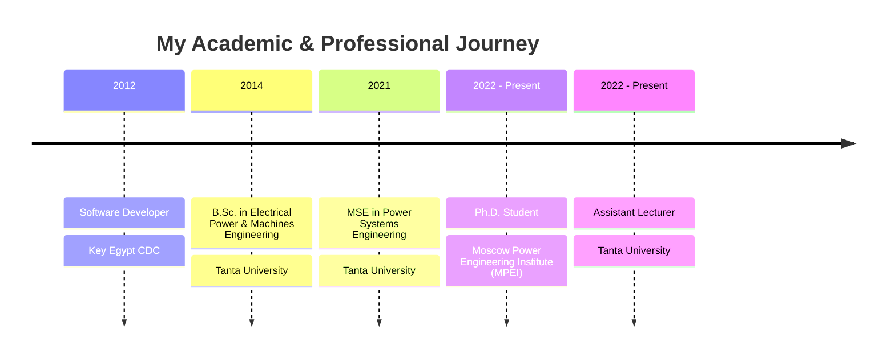

# 

  

I'm a PhD student at the Moscow Power Engineering Institute (MPEI) and an Assistant Lecturer at Tanta University, specializing in Power Systems Engineering. My research focuses on FACTS devices, industrial protection, and decarbonization. I'm passionate about developing software solutions for modern power system challenges.

## 💻 Technical Skills

## 🔭 Featured Projects

_I can help you add your key projects here. Could you please provide a list of your top 2-3 repositories you'd like to feature?_

## 📝 Publications

  
<b>View Selected Research Papers</b>

   
  <ul>
    <li>Elkholy, A., et al. (2024). "<i>Comprehensive Study of the Impact of Unbalanced Loading on Power Losses and Voltage Quality in Distribution Systems</i>." IEEE Transactions on Power Systems.</li>
    <li>Elkholy, A., et al. (2023). "<i>Design and Implementation of an Arc Suppression Device for Single Line to Ground Faults in Power Systems</i>." IEEE International Conference on Power Electronics.</li>
    <li>Elkholy, A., et al. (2022). "<i>Advanced FACTS Device Integration for Power Quality Enhancement</i>." International Conference on Industrial Protection Systems.</li>
    <li>Elkholy, A., et al. (2021). "<i>Wind Energy Penetration Impact on Power System Performance</i>." Renewable Energy Conference.</li>
  </ul>
  <a href="https://scholar.google.com/citations?user=KbZs8_AAAAAJ&hl=en">View all publications on Google Scholar →</a>

## 🎓 Education & Experience

## 📫 Get in Touch

  
  
  
  
  
  

<!-- ## 📊 GitHub Stats

  
  

 -->
