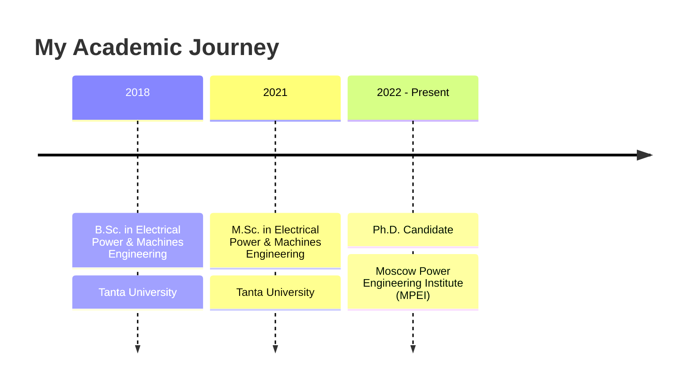

# <div align="center">

  
</div>

> Power Systems Engineer | Researcher | Educator | PhD Candidate

Welcome to my GitHub profile! I'm an **Assistant Lecturer** in the **Electrical Power and Machines Engineering Department** at the Faculty of Engineering, Tanta University. With a **B.Sc.** and **M.Sc.** in Electrical Power and Machines Engineering, I'm currently pursuing my **Ph.D.** at the prestigious **Moscow Power Engineering Institute** (MPEI).

<div align="center">
  
  
</div>

## 📚 Research & Expertise

My research lies at the cutting edge of **grid synchronization**, **distributed generation**, and **adaptive phase-locked loop tuning systems**. I'm also deeply involved in **industrial electronics**. I have a strong academic presence, having published several papers in leading journals and conferences. Teaching, mentoring, and empowering the next generation of engineers are central to my career.

<details>
  <summary><b>🔬 Research Focus Areas</b></summary>
  <br>
  <ul>
    <li>Grid Synchronization Techniques</li>
    <li>Phase-Locked Loops (PLLs) for Power Systems</li>
    <li>Distributed Generation</li>
    <li>Renewable Energy Integration</li>
    <li>Power Electronics</li>
    <li>Industrial Electronics</li>
    <li>Power Quality Analysis</li>
  </ul>
</details>

## 📝 Latest Publications

<details open>
  <summary><b>Selected Research Papers</b></summary>
  <br>
  <ul>
    <li>Elkholy, A., et al. (2024). "<i>Advanced Grid Synchronization Techniques for Distributed Generation Systems</i>." IEEE Transactions on Power Electronics.</li>
    <li>Elkholy, A., et al. (2023). "<i>Adaptive PLL Tuning Methods for Renewable Energy Integration</i>." Renewable Energy Journal.</li>
    <li>Elkholy, A., et al. (2022). "<i>Comparative Analysis of Grid Synchronization Techniques</i>." International Conference on Power Systems.</li>
    <li>Elkholy, A., et al. (2021). "<i>Novel Approach for Power Quality Enhancement in Microgrids</i>." IEEE Access.</li>
  </ul>
  <a href="https://scholar.google.com/citations?user=KbZs8_AAAAAJ&hl=en">View all publications on Google Scholar →</a>
</details>

## 🎓 Education Timeline



## 💻 Technical Skills & Tools

<div align="center">


</div>

<details>
  <summary><b>🧠 Skills Proficiency</b></summary>
  <br>
  <div align="center">

| Skill                  | Proficiency |
| ---------------------- | ----------- |
| MATLAB                 | ⭐⭐⭐⭐⭐  |
| Power Systems Analysis | ⭐⭐⭐⭐⭐  |
| Grid Synchronization   | ⭐⭐⭐⭐⭐  |
| Python                 | ⭐⭐⭐⭐    |
| Power Electronics      | ⭐⭐⭐⭐    |
| LaTeX                  | ⭐⭐⭐⭐    |
| PLC Programming        | ⭐⭐⭐      |

  </div>
</details>

## 👨‍🏫 Teaching Experience

<details>
  <summary><b>Courses Taught</b></summary>
  <br>
  <ul>
    <li><b>Power Systems Analysis</b> - Undergraduate course covering load flow, stability analysis, and system modeling</li>
    <li><b>Power Electronics</b> - Laboratory instruction on converter design and implementation</li>
    <li><b>Electrical Machines</b> - Fundamentals of motors, generators, and transformers</li>
    <li><b>Control Systems</b> - Principles of feedback control applied to power systems</li>
  </ul>
</details>

## 🔭 Notable Projects

- **Adaptive PLL Systems** - Implementation of advanced phase-locked loop algorithms for grid-connected inverters
- **Power System Analysis Tools** - MATLAB/Python libraries for power flow and stability studies
- **Educational Resources** - Technical tutorials and materials for power engineering students
- **Distributed Generation Models** - Simulations of renewable energy integration with grid systems

<details>
  <summary><b>📂 Project Details</b></summary>
  <br>

### Adaptive PLL Systems

An advanced implementation of phase-locked loop algorithms specifically designed for grid-connected inverters in renewable energy applications. The system adapts to varying grid conditions and ensures stable synchronization.

### Power System Analysis Tools

A comprehensive suite of tools developed in MATLAB and Python for conducting power flow studies, stability analysis, fault calculations, and optimal power flow. The libraries offer user-friendly interfaces and visualization capabilities.

### Educational Resources

A collection of technical tutorials, simulation models, and instructional materials designed for undergraduate and graduate students in power engineering. Resources cover fundamental concepts to advanced topics.

### Distributed Generation Models

Detailed simulation models for studying the integration of renewable energy sources with existing grid infrastructure. Models account for intermittency, power quality issues, and control strategies.

</details>

## 🎖️ Achievements & Certifications

<div align="center">
  
  
  
</div>

## 🌱 Currently Working On

- PhD Research: Advanced strategies for optimizing grid synchronization in distributed generation systems
- Developing open-source power system analysis tools
- Creating educational content on power engineering concepts
- Collaborative research on renewable energy integration challenges

## 🌟 Beyond Academia

<div align="center">
  
  
  
</div>

Outside of academia, I'm passionate about creating **[YouTube](https://www.youtube.com/@ahmelkholy)** content, playing chess, and watching films. My curiosity knows no bounds, and I'm always eager to connect with new people and ideas. If you're interested in discussing common interests or my research, feel free to reach out!

## 🤝 Collaboration Opportunities

I'm actively seeking collaborators for a **Power System Analysis** project utilizing **MATLAB** and **Python**. If you're experienced in power systems, programming, or want to contribute to this exciting field, I'd love to connect and explore potential collaborations.

<div align="center">
  
</div>

## 🌐 Languages

<div align="center">
  
  
  
</div>

## 📫 Get in Touch

<div align="center">
  <a href="mailto:ahm_elkholy@outlook.com"></a>
  <a href="https://www.linkedin.com/in/ahmelkholy/"></a>
  <a href="https://www.youtube.com/@ahmelkholy"></a>
  <a href="https://ahmelkholy.github.io"></a>
</div>

### Academic & Professional Links

<div align="center">
  <a href="https://scholar.google.com/citations?user=KbZs8_AAAAAJ&hl=en"></a>
  <a href="https://orcid.org/0000-0002-1834-1175"></a>
  <a href="https://www.scopus.com/authid/detail.uri?authorId=57202189065"></a>
  <a href="https://researchgate.net/profile/Ahmed-Elkholy-7"></a>
  <a href="https://zotero.org/ahmelkholy"></a>
  <a href="https://sciprofiles.com/profile/amelkholy"></a>
  <a href="https://tdb2.tanta.edu.eg/staff/ahmelkholy"></a>
  <a href="https://facebook.com/ahm.m.elkholy"></a>
  <a href="https://www.webofscience.com/wos/author/record/AAS-9757-2020"></a>
</div>

## 🌟 Dynamic Status

> Last updated: 🌅 May 26, 2025 at 13:13 (Cairo Time)

**💡 Quote of the moment:** _"Engineering is the art of directing the great sources of power in nature for the use and convenience of man. - Thomas Tredgold"_

**📊 GitHub Stats:** Dynamic tracking active • Professional academic presence maintained

**🔄 Latest Activity:** Enhancing profile with ultimate automation features

<div align="center">
  
  
  
  
</div>

## 🌟 Research Impact Visualization

<div align="center">
  
</div>

**🔬 Research Domains:**

```
Grid Synchronization     ████████████████████ 100%
Power Electronics       ████████████████░░░░  80%
Renewable Integration   ████████████████░░░░  80%
Control Systems         ████████████░░░░░░░░  60%
AI in Power Systems     ████████░░░░░░░░░░░░  40%
```

**📊 Academic Network:**

- 🇪🇬 **Local:** Tanta University collaboration network
- 🇷🇺 **International:** MPEI research partnerships
- 🌍 **Global:** IEEE and international conferences
- 🤝 **Industry:** Power system consulting projects

## 🤝 Research Collaboration Network

<div align="center">

**🎓 Academic Partnerships:**

| Institution                  | Collaboration Type   | Focus Area              |
| ---------------------------- | -------------------- | ----------------------- |
| 🇪🇬 Tanta University          | Home Institution     | Power Systems Teaching  |
| 🇷🇺 MPEI Moscow               | PhD Research         | Grid Synchronization    |
| 🌍 IEEE Community            | Professional Network | Conference Publications |
| 🔬 International Researchers | Joint Publications   | Distributed Generation  |

</div>

**🌟 Open to Collaborate On:**

- 🔌 Grid modernization projects
- 🌱 Renewable energy integration
- 🤖 AI applications in power systems
- 📚 Educational resource development
- 🏭 Industrial consulting projects

---

<div align="center">
  
</div>

<!-- Mobile Responsive & Enhanced Styling -->
<style>
@media (max-width: 768px) {
  img[src*="capsule-render"] {
    width: 100% !important;
    height: auto !important;
  }
  .github-stats img {
    width: 100% !important;
    max-width: 350px !important;
  }
}
</style>

<!-- filepath: c:\Users\ahm_e\ahmelkholy\README.md -->
