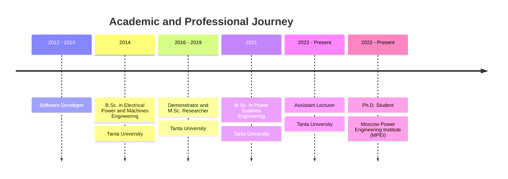

# Ahmed Elkholy

**Power Systems Engineer | Researcher | Developer**

I work at the intersection of power systems engineering, applied research, and scientific software development. I am a Ph.D. student at the Moscow Power Engineering Institute (MPEI) and an Assistant Lecturer at Tanta University, with a focus on distribution networks, FACTS devices, industrial protection, renewable energy integration, and grid stability.

My work combines mathematical modeling, simulation, optimization, and automation to help analyze complex power system behavior and turn research ideas into reliable engineering workflows.

  
  
  
  
  
  

## Professional Snapshot

| Area | Details |
| --- | --- |
| Current roles | Ph.D. Student at MPEI; Assistant Lecturer at Tanta University |
| Core domain | Power systems engineering, distribution networks, protection, stability, and grid modernization |
| Research direction | FACTS devices, industrial protection, renewable energy integration, and grid decarbonization |
| Technical approach | Mathematical modeling, simulation, optimization, reproducible research, and engineering automation |
| Development style | Research-driven tools, clean technical documentation, and practical engineering workflows |

## Focus Areas

- Power system stability, protection, and reliability in modern distribution networks.
- FACTS devices, industrial protection, and fault mitigation strategies.
- Renewable energy integration, wind power penetration, and grid decarbonization.
- Microgrid operation, intentional islanding, and distributed generation control.
- Scientific programming, simulation automation, and reproducible engineering research.

## Technical Toolkit

  
  
  
  
  
  
  
  
  
  
  

## Selected Projects

### Islanding Scenarios for Highly Reliable Operation in Distribution Networks

**Period:** 2017-2019

Modeled intentional islanding scenarios for smart distribution networks and studied stability behavior during grid isolation. The work focused on distributed generation controller behavior and stable load support during blackout-risk conditions.

**Key themes:** microgrids, intentional islanding, distributed generation control, distribution network reliability.

### Impact of Large Wind Energy Penetration on Electric Power Systems

**Period:** 2013-2014

Used ETAP-based studies and k-means clustering on the IEEE 30-bus system to evaluate wind turbine placement strategies. The objective was to reduce losses while improving voltage profiles and overall system stability.

**Key themes:** renewable integration, wind power planning, voltage profile improvement, loss minimization.

## Publications

  
<b>Selected Research Papers</b>

   
  <ul>
    <li>Elkholy, A., et al. "<i>Comprehensive Study of the Impact of Unbalanced Loading on Power Losses and Voltage Quality in Distribution Systems</i>." 2024 IEEE 25th International Conference of Young Professionals in Electron Devices and Materials (EDM).</li>
    <li>Elkholy, A., et al. "<i>Design and Implementation of an Arc Suppression Device for Single Line to Ground Faults in Power Systems</i>." 2023 24th International Middle East Power Systems Conference (MEPCON).</li>
  </ul>
  <a href="https://scholar.google.com/citations?user=KbZs8_AAAAAJ&hl=en">View all publications on Google Scholar</a>

## Education and Experience

```mermaid
timeline
    title Academic and Professional Journey
    2012 - 2014 : Software Developer
    2014 : B.Sc. in Electrical Power and Machines Engineering : Tanta University
    2016 - 2019 : Demonstrator and M.Sc. Researcher : Tanta University
    2021 : M.Sc. in Power Systems Engineering : Tanta University
    2022 - Present : Assistant Lecturer : Tanta University
    2022 - Present : Ph.D. Student : Moscow Power Engineering Institute (MPEI)
```

## Honors and Awards

- **Foreign Mission Envoys Winner** - Scholarship from the Ministry of Higher Education.
- **Distinction and Class Honors** - Ranked sixth, Tanta University, 2014.

## Collaboration

I am interested in research and engineering collaborations related to power system reliability, renewable integration, smart distribution networks, protection systems, and simulation-driven analysis.
