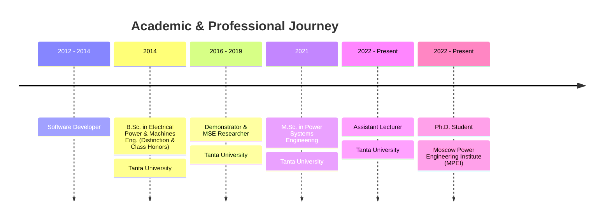

# Ahmed Elkholy

> Power Systems Engineer · Researcher · Developer

I am Ahmed Elkholy, a Ph.D. Student at the Moscow Power Engineering Institute (MPEI) and an Assistant Lecturer at Tanta University. As a Researcher-Developer hybrid and VS Code Power User, my specialization bridges Power Systems Engineering, FACTS devices, industrial protection, and grid decarbonization. I develop high-performance energy software solutions, leveraging mathematical modeling to solve modern power system stability and integration challenges.

## 🛠️ Technical Skills

  
  
  
  
  
  
  
  
  
  
  
  

## 🚀 Featured Projects

* **Islanding Scenarios for High Reliable Operation in Distribution Networks (2017 – 2019)**
    Modeled smart microgrid intentional islanding and power system stability. Designed DG controllers to mitigate distribution network blackouts by dynamically supplying stable loads during grid isolation.
* **Impact of Large Wind Energy Penetration on Electric Power Systems (2013 – 2014)**
    Utilized ETAP and K-Mean clustering on the IEEE 30 Bus system to optimize wind turbine locations, simultaneously minimizing losses and enhancing voltage profiles and system stability.

## 📚 Publications

  
<b>Selected Research Papers</b>

   
  <ul>
    <li>Elkholy, A., et al. (2024). "<i>Comprehensive Study of the Impact of Unbalanced Loading on Power Losses and Voltage Quality in Distribution Systems</i>." 2024 IEEE 25th International Conference of Young Professionals in Electron Devices and Materials (EDM).</li>
    <li>Elkholy, A., et al. (2024). "<i>Design and Implementation of an Arc Suppression Device for Single Line to Ground Faults in Power Systems</i>." 2023 24th International Middle East Power System Conference (MEPCON).</li>
  </ul>
  <a href="https://scholar.google.com/citations?user=KbZs8_AAAAAJ&hl=en">View all publications on Google Scholar ↗</a>

## ⏳ Education & Experience

```mermaid
timeline
    title Academic & Professional Journey
    2012 - 2014 : Software Developer
    2014 : B.Sc. in Electrical Power & Machines Eng. (Distinction & Class Honors) : Tanta University
    2016 - 2019 : Demonstrator & MSE Researcher : Tanta University
    2021 : M.Sc. in Power Systems Engineering : Tanta University
    2022 - Present : Assistant Lecturer : Tanta University
    2022 - Present : Ph.D. Student : Moscow Power Engineering Institute (MPEI)
```

## 🏆 Honors & Awards

  * **The Foreign Mission Envoys Winner** - Scholarship from the Ministry of Higher Education
  * **Distinction and Class Honors** - Ranked Sixth, Tanta University (2014)

## 🌐 Get in Touch

